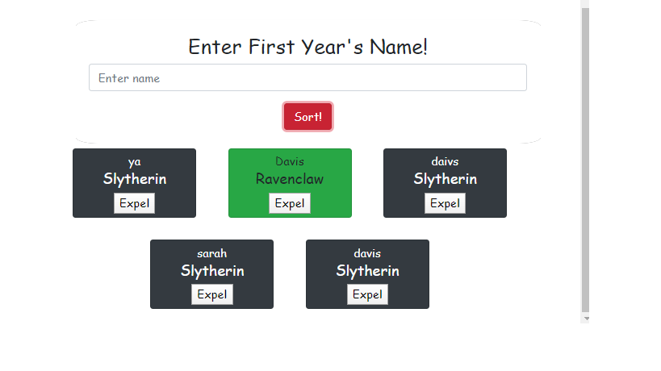

# sorting-hat

## Description
The project explores taking in data from form. The JS the randomly assings the name to a certain "House." These names can be removed from the database by pressing and "expel" button that removes the item from the array.
## Screenshot

## How to run 
1. Clone down this repo

1. Make sure you have http-server installed via npm. If not get it [HERE](https://www.npmjs.com/package/http-server).

1. In your command line run `hs -p 9999`

1. In your browser go to to `http://localhost:9999`
